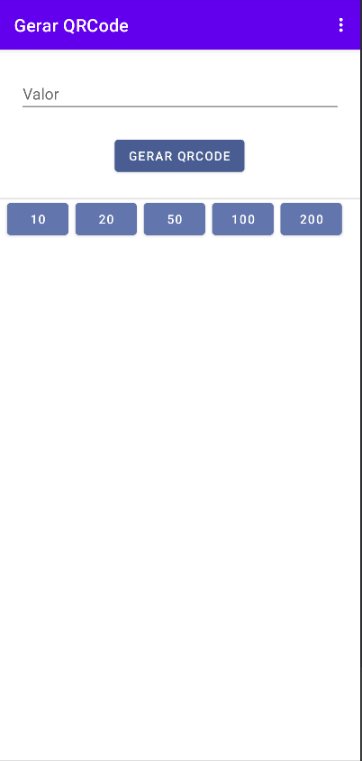
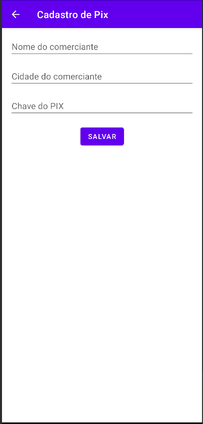

# QRPay APP

Aplicativo de geração de QRCode para pagamento via pix com valor previamente informado.

# Telas

- Load

- Home

- Cadastro de PIX

## Referência

- [QRPay Core](http://github/gsantosc18/qrpay)